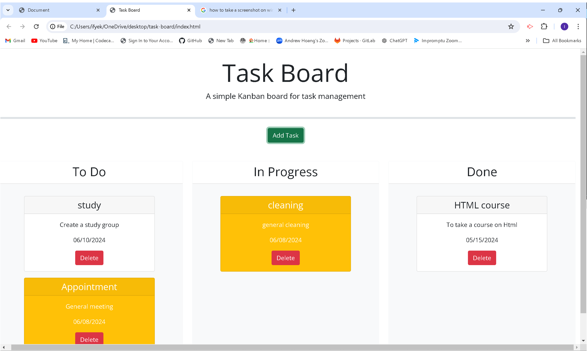

# Task Board
Task Board is a project management application i built in order to help user keep track of task to dos, due dates and task progress. It is a very simple application to use .

To input data in this application,user clicks the "Add Task" button. A modal would drop down and there, you will fill in the Task title, click the Due date box to select due date from the calendar drop down and finally type in the task description on the Description box. Then click "Add Task". The application will authomatically create a task card for you and place it in the appropriate column based on the due date user selected. Tge "To do" card has a white background color, the "In Progress" column has a yellow background and the Done has a white background color when its on the "done" column but a red background color when its on any other column.

Please click on the link below to use this application:
https://ifylee.github.io/task-board/

